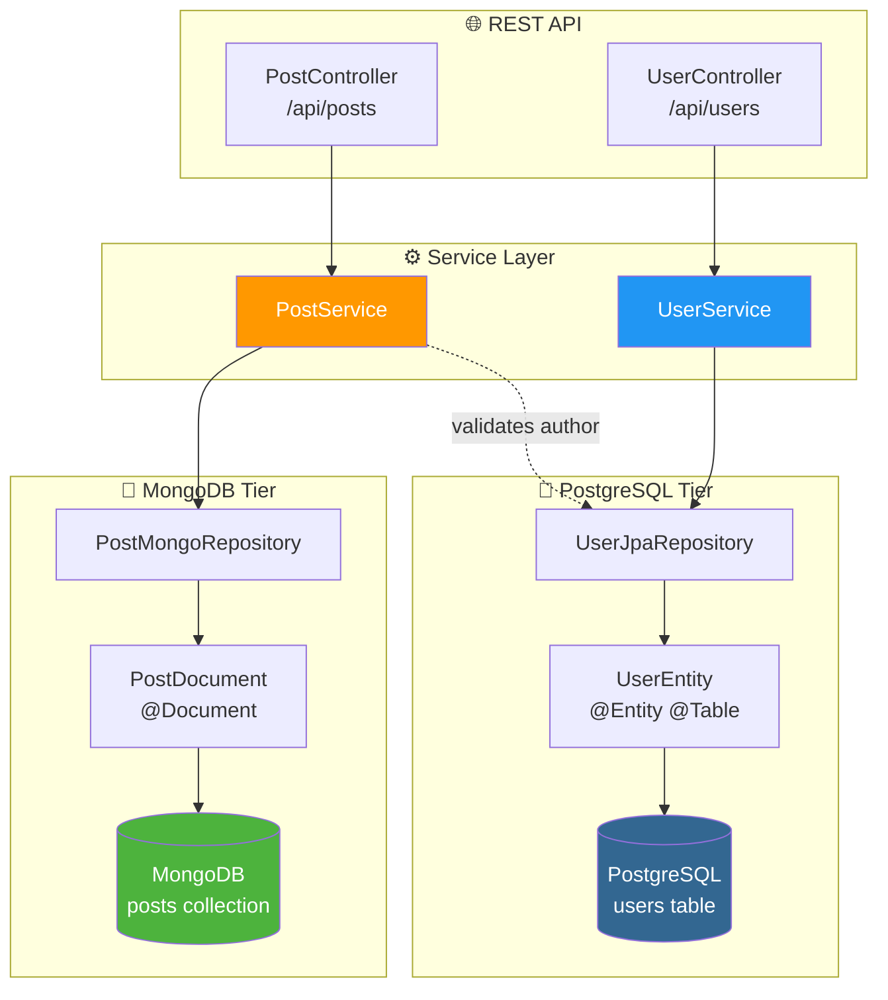
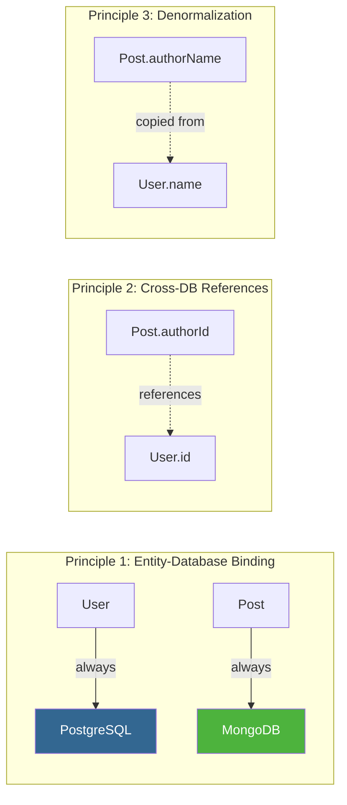
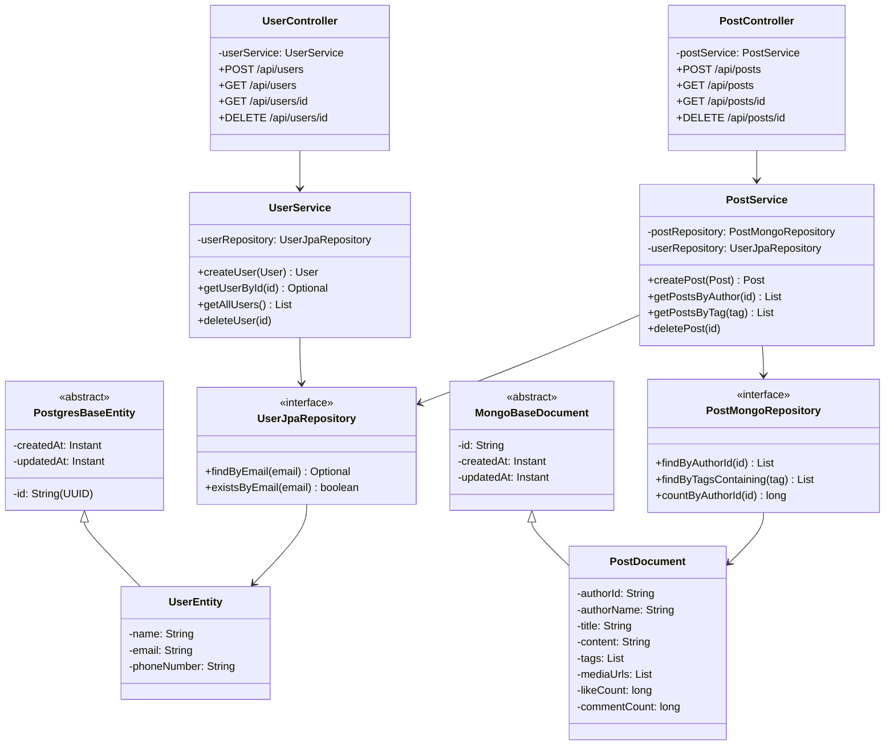
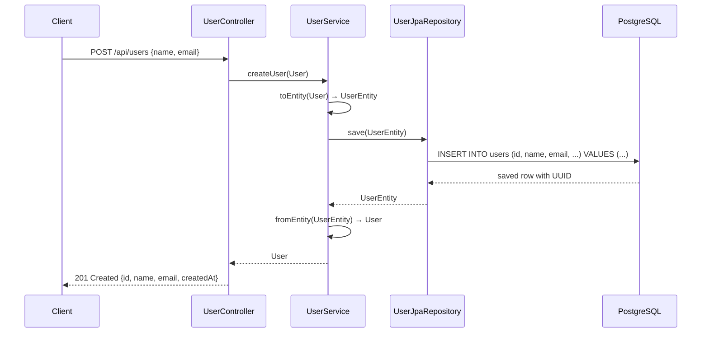
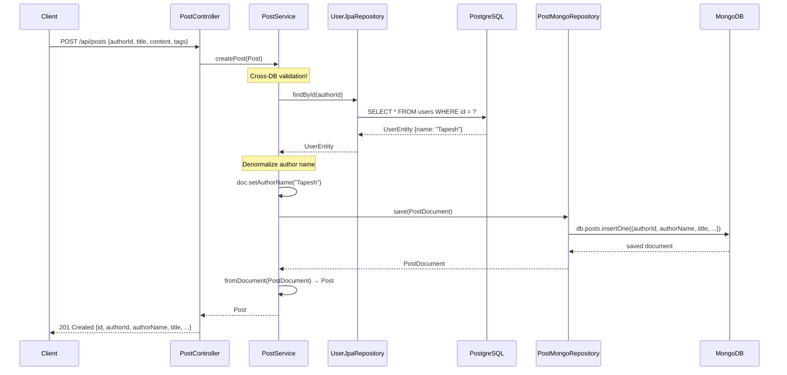
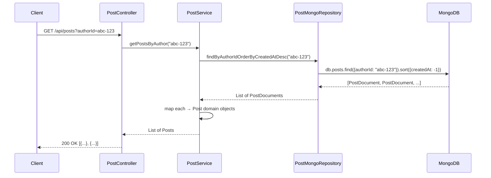
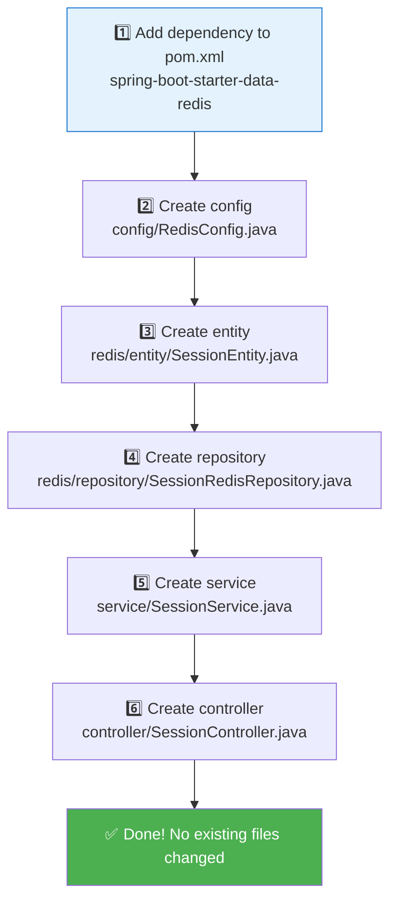

<p align="center">
  
  
  
  
  
</p>

# 🏗️ Two-Tier Database — Polyglot Persistence Architecture

> A production-grade **polyglot persistence** architecture where **different entities live in different databases**: Users in PostgreSQL, Posts in MongoDB — extensible to any new database with zero changes to existing code.

---

## 📑 Table of Contents

- [Architecture Overview](#-architecture-overview)
- [System Design — Polyglot Persistence](#-system-design--polyglot-persistence)
- [Project Structure](#-project-structure)
- [Request Flow Diagrams](#-request-flow-diagrams)
- [How to Add a New Database](#-how-to-add-a-new-database)
- [API Reference](#-api-reference)
- [Getting Started](#-getting-started)
- [Tech Stack](#-tech-stack)

---

## 🏛️ Architecture Overview



### Key Design Decision

| Data | Database | Why |
|------|----------|-----|
| **Users** (name, email, phone) | PostgreSQL | Structured, relational, ACID transactions, unique constraints |
| **Posts** (content, tags, media) | MongoDB | Flexible schema, nested arrays, document-oriented, horizontal scaling |

---

## 🎯 System Design — Polyglot Persistence

**Polyglot Persistence** = using the **right database for the right data**. Instead of forcing everything into one database, each entity type lives in the database that best suits its data model.

### Design Principles



| Principle | Implementation |
|-----------|---------------|
| **Entity-Database Binding** | Each entity is permanently bound to one database. No routing, no switching. |
| **Cross-DB References** | `Post.authorId` stores the PostgreSQL User ID — a foreign key across databases. |
| **Denormalization** | `Post.authorName` is copied from User to avoid cross-DB joins at read time. |
| **Service Orchestration** | `PostService` uses both `PostMongoRepository` AND `UserJpaRepository` to validate authors. |
| **Open/Closed Principle** | Adding a new entity+database = new files only. Zero changes to existing code. |

### Class Diagram



---

## 📁 Project Structure

```
two-tier-db/
├── docker-compose.yml                                 # PostgreSQL + MongoDB
├── pom.xml                                            # Maven dependencies
├── src/main/
│   ├── java/com/twotier_db/
│   │   ├── DemoApplication.java                       # Entry point
│   │   │
│   │   ├── config/                                    # ⚙️ DATABASE CONFIGS
│   │   │   ├── PostgresConfig.java                    #   JPA + auditing
│   │   │   └── MongoConfig.java                       #   MongoDB + auditing
│   │   │
│   │   ├── postgres/                                  # 🐘 POSTGRESQL MODULE
│   │   │   ├── entity/
│   │   │   │   ├── PostgresBaseEntity.java            #   Base: id + timestamps
│   │   │   │   └── UserEntity.java                    #   @Entity → users table
│   │   │   └── repository/
│   │   │       └── UserJpaRepository.java             #   Spring Data JPA
│   │   │
│   │   ├── mongo/                                     # 🍃 MONGODB MODULE
│   │   │   ├── document/
│   │   │   │   ├── MongoBaseDocument.java             #   Base: id + timestamps
│   │   │   │   └── PostDocument.java                  #   @Document → posts collection
│   │   │   └── repository/
│   │   │       └── PostMongoRepository.java           #   Spring Data MongoDB
│   │   │
│   │   ├── model/                                     # 📦 DOMAIN MODELS
│   │   │   ├── User.java                              #   DB-agnostic User POJO
│   │   │   └── Post.java                              #   DB-agnostic Post POJO
│   │   │
│   │   ├── service/                                   # 🔧 BUSINESS LOGIC
│   │   │   ├── UserService.java                       #   Users → PostgreSQL
│   │   │   └── PostService.java                       #   Posts → MongoDB
│   │   │
│   │   └── controller/                                # 🌐 REST API
│   │       ├── UserController.java                    #   /api/users
│   │       └── PostController.java                    #   /api/posts
│   │
│   └── resources/
│       └── application.yml
└── README.md
```

---

## 🔄 Request Flow Diagrams

### Create User → PostgreSQL



### Create Post → MongoDB (with PostgreSQL validation)



### Get Posts by Author



---

## 🔌 How to Add a New Database

Adding a new database (e.g., **Redis** for sessions) requires only **new files** — zero changes to existing code.



### Example: Adding Cassandra for Analytics

```
cassandra/
├── entity/
│   ├── CassandraBaseEntity.java
│   └── AnalyticsEventEntity.java       # @Table
├── repository/
│   └── AnalyticsEventRepository.java   # CassandraRepository<...>
```

```java
// service/AnalyticsService.java — directly uses CassandraRepository
@Service
public class AnalyticsService {
    private final AnalyticsEventRepository analyticsRepo;
    // ... no routing, no factory, just direct usage
}
```

**Files changed in existing code: 0**

---

## 📡 API Reference

### Users (PostgreSQL)

| Method | Endpoint | Description |
|--------|----------|-------------|
| `POST` | `/api/users` | Create a user |
| `GET` | `/api/users` | List all users |
| `GET` | `/api/users/{id}` | Get user by ID |
| `DELETE` | `/api/users/{id}` | Delete a user |
| `GET` | `/api/users/count` | Count users |

### Posts (MongoDB)

| Method | Endpoint | Query Params | Description |
|--------|----------|-------------|-------------|
| `POST` | `/api/posts` | — | Create a post (requires `authorId`) |
| `GET` | `/api/posts` | `?authorId=...` or `?tag=...` | List posts (filterable) |
| `GET` | `/api/posts/{id}` | — | Get post by ID |
| `DELETE` | `/api/posts/{id}` | — | Delete a post |
| `GET` | `/api/posts/count` | `?authorId=...` | Count posts by author |

### Usage Examples

```bash
# 1. Create a user (→ PostgreSQL)
curl -X POST http://localhost:8080/api/users \
  -H "Content-Type: application/json" \
  -d '{"name":"Tapesh","email":"tapesh@example.com","phoneNumber":"+91-9999999999"}'

# Response: {"id":"abc-123", "name":"Tapesh", "email":"tapesh@example.com", ...}

# 2. Create a post by that user (→ MongoDB)
curl -X POST http://localhost:8080/api/posts \
  -H "Content-Type: application/json" \
  -d '{
    "authorId": "abc-123",
    "title": "My First Post",
    "content": "Hello from MongoDB!",
    "tags": ["intro", "hello"],
    "mediaUrls": ["https://example.com/photo.jpg"]
  }'

# Response: {"id":"...", "authorId":"abc-123", "authorName":"Tapesh", "title":"My First Post", ...}

# 3. Get all posts by author
curl http://localhost:8080/api/posts?authorId=abc-123

# 4. Get all posts with a tag
curl http://localhost:8080/api/posts?tag=intro
```

---

## 🚀 Getting Started

### Prerequisites
- Java 17+
- Docker & Docker Compose

### Run

```bash
git clone https://github.com/tapeshchavle/multiple_db.git
cd multiple_db

# Start databases
docker-compose up -d

# Run the application
./mvnw spring-boot:run
```

---

## 🛠️ Tech Stack

| Technology | Purpose |
|-----------|---------|
| **Spring Boot 4.0.6** | Application framework |
| **Spring Data JPA** | PostgreSQL ORM (Users) |
| **Spring Data MongoDB** | MongoDB ODM (Posts) |
| **PostgreSQL 16** | Relational database for Users |
| **MongoDB 7** | Document database for Posts |
| **Lombok** | Boilerplate reduction |
| **Docker Compose** | Local database orchestration |

---

<p align="center">
  <b>Built with ❤️ by <a href="https://github.com/tapeshchavle">Tapesh Chavle</a></b>
</p>
