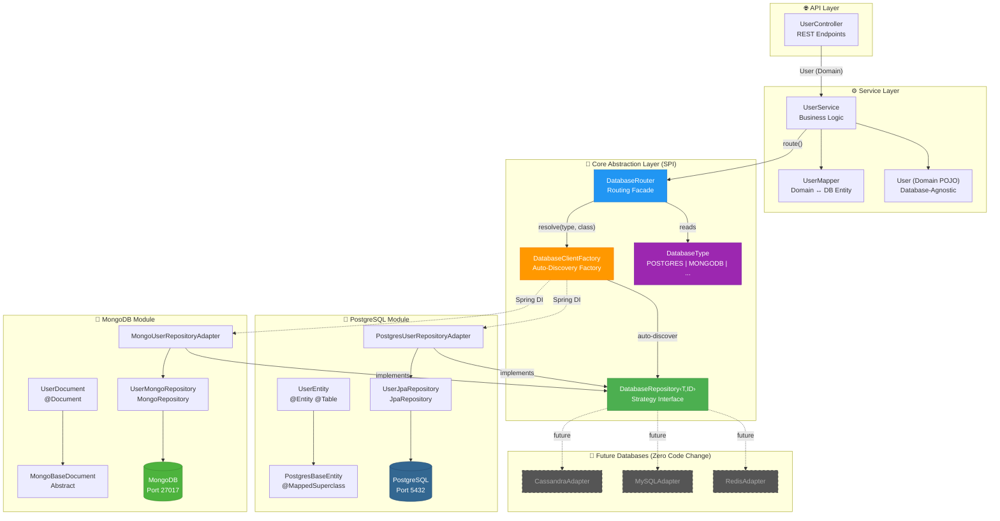
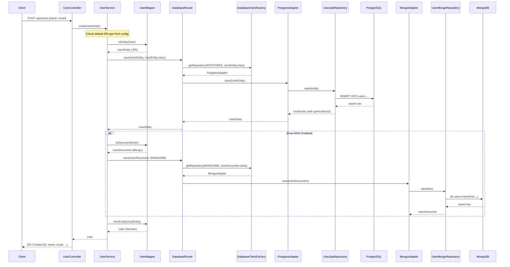
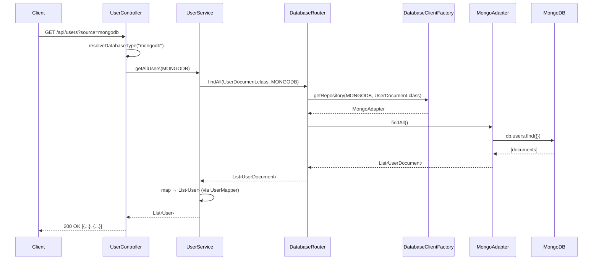

<p align="center">
  
  
  
  
  
</p>

# 🏗️ Two-Tier Database — Scalable Multi-Database Architecture

> A **plug-and-play database abstraction layer** for Spring Boot that supports **PostgreSQL** (SQL) and **MongoDB** (NoSQL) out of the box — add any new database (Cassandra, MySQL, DynamoDB) with **zero changes to existing code**.

---

## 📑 Table of Contents

- [Why This Architecture?](#-why-this-architecture)
- [System Design Overview](#-system-design-overview)
- [Design Patterns Used](#-design-patterns-used)
- [Architecture Deep Dive](#-architecture-deep-dive)
- [Project Structure](#-project-structure)
- [How It Works — Request Flow](#-how-it-works--request-flow)
- [How to Add a New Database](#-how-to-add-a-new-database)
- [API Reference](#-api-reference)
- [Getting Started](#-getting-started)
- [Configuration](#%EF%B8%8F-configuration)
- [Tech Stack](#-tech-stack)

---

## 🤔 Why This Architecture?

Most applications start with a single database but inevitably need to support multiple databases as they scale:

| Scenario | Solution |
|----------|----------|
| **Structured data** (users, orders, transactions) | PostgreSQL (ACID-compliant, relational) |
| **Unstructured/flexible data** (logs, analytics, documents) | MongoDB (schema-less, horizontal scaling) |
| **Future needs** (time-series, graph, cache) | Add Cassandra, Neo4j, Redis — without rewriting |

**The problem:** Without proper abstraction, adding a new database means modifying service layers, creating new DAOs, and potentially breaking existing functionality.

**Our solution:** An **SPI (Service Provider Interface)** that auto-discovers new database adapters at startup — new databases are "plugged in" like USB devices.

---

## 🏛️ System Design Overview

### High-Level Architecture

```
┌──────────────────────────────────────────────────────────────────────┐
│                         CLIENT (REST API)                            │
│                      POST/GET /api/users                             │
└──────────────────────────┬───────────────────────────────────────────┘
                           │
                           ▼
┌──────────────────────────────────────────────────────────────────────┐
│                       CONTROLLER LAYER                               │
│                      UserController.java                             │
│              (Accepts ?source=postgres|mongodb)                      │
└──────────────────────────┬───────────────────────────────────────────┘
                           │
                           ▼
┌──────────────────────────────────────────────────────────────────────┐
│                        SERVICE LAYER                                 │
│         UserService.java  ←→  UserMapper.java                        │
│    (Domain model User — completely database-agnostic)                │
└──────────────────────────┬───────────────────────────────────────────┘
                           │
                           ▼
┌──────────────────────────────────────────────────────────────────────┐
│                    ★ CORE ABSTRACTION (SPI) ★                        │
│  ┌─────────────┐  ┌──────────────────┐  ┌──────────────────────┐    │
│  │DatabaseRouter│→ │DatabaseClient    │→ │DatabaseRepository    │    │
│  │  (Facade)   │  │  Factory         │  │  <T, ID>             │    │
│  │             │  │  (Auto-discovers) │  │  (Strategy Interface)│    │
│  └─────────────┘  └──────────────────┘  └──────────┬───────────┘    │
└─────────────────────────────────────────────────────┼────────────────┘
                           ┌──────────────────────────┼───────┐
                           │                          │       │
                           ▼                          ▼       ▼
              ┌────────────────────┐    ┌──────────────────────────┐
              │  POSTGRES MODULE   │    │    MONGODB MODULE         │
              │ ┌────────────────┐ │    │ ┌──────────────────────┐ │
              │ │ PostgresUser   │ │    │ │ MongoUser             │ │
              │ │ RepoAdapter    │ │    │ │ RepoAdapter           │ │
              │ └───────┬────────┘ │    │ └──────────┬───────────┘ │
              │         ▼          │    │            ▼             │
              │ ┌────────────────┐ │    │ ┌──────────────────────┐ │
              │ │ UserJpa        │ │    │ │ UserMongo             │ │
              │ │ Repository     │ │    │ │ Repository            │ │
              │ └───────┬────────┘ │    │ └──────────┬───────────┘ │
              │         ▼          │    │            ▼             │
              │    ┌─────────┐     │    │     ┌───────────┐       │
              │    │PostgreSQL│     │    │     │  MongoDB  │       │
              │    └─────────┘     │    │     └───────────┘       │
              └────────────────────┘    └──────────────────────────┘
```

### Component Interaction Diagram



---

## 🎯 Design Patterns Used

### 1. Strategy Pattern
> **"Define a family of algorithms, encapsulate each one, and make them interchangeable."**

Each database adapter is a **strategy** that implements the `DatabaseRepository<T, ID>` interface. The system can switch between strategies (Postgres ↔ MongoDB) at runtime without modifying any client code.

```java
// The Strategy Interface
public interface DatabaseRepository<T extends DatabaseEntity<ID>, ID> {
    T save(T entity);
    Optional<T> findById(ID id);
    List<T> findAll();
    void deleteById(ID id);
    DatabaseType getDatabaseType();  // self-identification
}

// Strategy A: PostgreSQL
@Component
public class PostgresUserRepositoryAdapter implements DatabaseRepository<UserEntity, String> {
    // delegates to Spring Data JPA
}

// Strategy B: MongoDB
@Component
public class MongoUserRepositoryAdapter implements DatabaseRepository<UserDocument, String> {
    // delegates to Spring Data MongoDB
}
```

```
                    ┌─────────────────────┐
                    │  DatabaseRepository  │  ← Strategy Interface
                    │     <T, ID>          │
                    └──────────┬──────────┘
                               │
              ┌────────────────┼────────────────┐
              │                │                │
    ┌─────────▼──────┐  ┌─────▼────────┐  ┌────▼──────────┐
    │ PostgresUser   │  │ MongoUser    │  │ CassandraUser │
    │ RepoAdapter    │  │ RepoAdapter  │  │ RepoAdapter   │
    │ (Strategy A)   │  │ (Strategy B) │  │ (Strategy C)  │
    └────────────────┘  └──────────────┘  └───────────────┘
         [EXISTS]           [EXISTS]         [FUTURE - 0 code change]
```

### 2. Abstract Factory Pattern
> **"Provide an interface for creating families of related objects without specifying their concrete classes."**

`DatabaseClientFactory` collects ALL `DatabaseRepository` beans via Spring DI and indexes them by `(DatabaseType, EntityClass)`. It resolves the correct adapter at runtime.

```java
@Component
public class DatabaseClientFactory {
    // Spring auto-injects ALL DatabaseRepository beans
    public DatabaseClientFactory(List<DatabaseRepository<?, ?>> repositories) {
        for (DatabaseRepository<?, ?> repo : repositories) {
            registry.put(repo.getDatabaseType(), repo.getEntityClass(), repo);
        }
        // New adapters are auto-registered — ZERO code changes!
    }
    
    public <T, ID> DatabaseRepository<T, ID> getRepository(DatabaseType type, Class<T> entityClass) {
        return registry.get(type, entityClass);  // resolved at runtime
    }
}
```

### 3. Facade Pattern
> **"Provide a unified interface to a set of interfaces in a subsystem."**

`DatabaseRouter` is the single entry point for all database operations. Services never interact with adapters directly.

```
   UserService  ──→  DatabaseRouter  ──→  DatabaseClientFactory  ──→  Adapter
   (simple API)      (unified facade)     (resolves correct one)      (actual DB)
```

### 4. SPI (Service Provider Interface)
> **"An API intended to be implemented by third parties for extending a system."**

New database adapters are discovered automatically at startup via Spring's component scanning. No registration code needed.

### 5. Open/Closed Principle (SOLID)
> **"Open for extension, closed for modification."**

| Action | Requires modifying existing code? |
|--------|-----------------------------------|
| Add a new database | ❌ No |
| Add a new entity | ❌ No (just create new adapters) |
| Change default database | ❌ No (just change `application.yml`) |
| Enable dual-write | ❌ No (just flip config flag) |

---

## 🔍 Architecture Deep Dive

### Core Layer (`core/`) — The Heart

```
core/
├── DatabaseType.java          # Enum: POSTGRES, MONGODB (add new constants for new DBs)
├── DatabaseEntity.java        # Marker interface: getId(), setId()
├── DatabaseRepository.java    # Strategy interface: CRUD + getDatabaseType()
├── DatabaseClientFactory.java # Abstract Factory: auto-discovers & resolves adapters
└── DatabaseRouter.java        # Facade: routes ops based on config (default DB, dual-write)
```

**Key principle:** This layer has **zero dependencies on any database technology**. It only defines contracts (interfaces) and orchestration logic.

### Database Modules — The Adapters

Each database module follows an identical structure:

```
postgres/                              mongo/
├── entity/                            ├── document/
│   ├── PostgresBaseEntity.java        │   ├── MongoBaseDocument.java
│   └── UserEntity.java               │   └── UserDocument.java
├── repository/                        ├── repository/
│   └── UserJpaRepository.java         │   └── UserMongoRepository.java
└── adapter/                           └── adapter/
    └── PostgresUserRepoAdapter.java       └── MongoUserRepoAdapter.java
```

### Dependency Direction (Clean Architecture)

```
Controller → Service → Core (interfaces) ← Adapters (implementations)
                         ↑                         ↑
                    NEVER reversed            NEVER access
                                              core internals
```

---

## 📁 Project Structure

```
two-tier-db/
├── docker-compose.yml                                    # PostgreSQL + MongoDB
├── pom.xml                                               # Maven dependencies
├── src/main/
│   ├── java/com/twotier_db/
│   │   ├── DemoApplication.java                          # Spring Boot entry point
│   │   │
│   │   ├── core/                                         # ★ ABSTRACTION LAYER
│   │   │   ├── DatabaseType.java                         #   Enum (POSTGRES, MONGODB)
│   │   │   ├── DatabaseEntity.java                       #   Marker interface
│   │   │   ├── DatabaseRepository.java                   #   Strategy interface
│   │   │   ├── DatabaseClientFactory.java                #   Auto-discovery factory
│   │   │   └── DatabaseRouter.java                       #   Routing facade
│   │   │
│   │   ├── config/                                       # ⚙️ DB CONFIGURATIONS
│   │   │   ├── PostgresConfig.java                       #   JPA / DataSource
│   │   │   └── MongoConfig.java                          #   MongoClient / Template
│   │   │
│   │   ├── postgres/                                     # 🐘 POSTGRESQL MODULE
│   │   │   ├── entity/
│   │   │   │   ├── PostgresBaseEntity.java               #   Abstract MappedSuperclass
│   │   │   │   └── UserEntity.java                       #   @Entity @Table("users")
│   │   │   ├── repository/
│   │   │   │   └── UserJpaRepository.java                #   JpaRepository
│   │   │   └── adapter/
│   │   │       └── PostgresUserRepositoryAdapter.java    #   Strategy implementation
│   │   │
│   │   ├── mongo/                                        # 🍃 MONGODB MODULE
│   │   │   ├── document/
│   │   │   │   ├── MongoBaseDocument.java                #   Abstract base document
│   │   │   │   └── UserDocument.java                     #   @Document("users")
│   │   │   ├── repository/
│   │   │   │   └── UserMongoRepository.java              #   MongoRepository
│   │   │   └── adapter/
│   │   │       └── MongoUserRepositoryAdapter.java       #   Strategy implementation
│   │   │
│   │   ├── model/                                        # 📦 DOMAIN LAYER
│   │   │   ├── User.java                                 #   DB-agnostic POJO
│   │   │   └── UserMapper.java                           #   Domain ↔ Entity mapper
│   │   │
│   │   ├── service/                                      # 🔧 BUSINESS LOGIC
│   │   │   └── UserService.java
│   │   │
│   │   └── controller/                                   # 🌐 REST API
│   │       └── UserController.java
│   │
│   └── resources/
│       └── application.yml                               # All DB configs
└── README.md
```

---

## 🔄 How It Works — Request Flow

### Sequence Diagram: Create User



### Sequence Diagram: Query with Source Selection



---

## 🔌 How to Add a New Database

Adding a new database (e.g., **Cassandra**) requires **exactly 3 steps** with **zero changes to existing code**.

### Step-by-Step Guide


#### Step 1: Add the dependency

```xml
<!-- pom.xml -->
<dependency>
    <groupId>org.springframework.boot</groupId>
    <artifactId>spring-boot-starter-data-cassandra</artifactId>
</dependency>
```

#### Step 2: Create the module package

```
cassandra/
├── entity/
│   ├── CassandraBaseEntity.java       # Base entity with Cassandra annotations
│   └── UserCassandraEntity.java       # @Table entity
├── repository/
│   └── UserCassandraRepository.java   # CassandraRepository<UserCassandraEntity, String>
└── adapter/
    └── CassandraUserRepositoryAdapter.java  # implements DatabaseRepository<...>
```

The adapter must implement `DatabaseRepository<T, ID>`:

```java
@Component
public class CassandraUserRepositoryAdapter 
        implements DatabaseRepository<UserCassandraEntity, String> {
    
    private final UserCassandraRepository repository;
    
    // ... delegate all CRUD methods to repository ...
    
    @Override
    public DatabaseType getDatabaseType() {
        return DatabaseType.CASSANDRA;  // self-identify
    }
    
    @Override
    public Class<UserCassandraEntity> getEntityClass() {
        return UserCassandraEntity.class;
    }
}
```

#### Step 3: Add the enum constant

```java
public enum DatabaseType {
    POSTGRES("PostgreSQL", Category.SQL),
    MONGODB("MongoDB", Category.NOSQL),
    CASSANDRA("Cassandra", Category.NOSQL);  // ← just add this line
    // ...
}
```

**That's it!** At startup, `DatabaseClientFactory` auto-discovers the new `CassandraUserRepositoryAdapter` via Spring DI and registers it. You can now:

```bash
# Query from Cassandra
curl http://localhost:8080/api/users?source=cassandra

# Set as default in application.yml
app:
  database:
    default-type: CASSANDRA
```

### What You DON'T Need to Change

| File | Change needed? |
|------|---------------|
| `DatabaseRepository.java` | ❌ No |
| `DatabaseClientFactory.java` | ❌ No |
| `DatabaseRouter.java` | ❌ No |
| `UserService.java` | ❌ No |
| `UserController.java` | ❌ No (just add `"cassandra"` case to resolver) |
| Any existing adapter | ❌ No |

---

## 📡 API Reference

### Base URL: `http://localhost:8080/api/users`

| Method | Endpoint | Query Params | Description |
|--------|----------|-------------|-------------|
| `POST` | `/api/users` | — | Create a new user |
| `GET` | `/api/users` | `?source=postgres\|mongodb` | List all users |
| `GET` | `/api/users/{id}` | `?source=postgres\|mongodb` | Get user by ID |
| `DELETE` | `/api/users/{id}` | — | Delete a user |
| `GET` | `/api/users/count` | — | Count users |

### Request/Response Examples

**Create User:**
```bash
curl -X POST http://localhost:8080/api/users \
  -H "Content-Type: application/json" \
  -d '{
    "name": "Tapesh Chavle",
    "email": "tapesh@example.com",
    "phoneNumber": "+91-9999999999"
  }'
```

```json
// Response: 201 Created
{
  "id": "a1b2c3d4-e5f6-7890-abcd-ef1234567890",
  "name": "Tapesh Chavle",
  "email": "tapesh@example.com",
  "phoneNumber": "+91-9999999999",
  "createdAt": "2026-04-30T02:15:00Z",
  "updatedAt": "2026-04-30T02:15:00Z"
}
```

**Query from a specific database:**
```bash
# From PostgreSQL
curl http://localhost:8080/api/users?source=postgres

# From MongoDB
curl http://localhost:8080/api/users?source=mongodb
```

---

## 🚀 Getting Started

### Prerequisites

- Java 17+
- Docker & Docker Compose
- Maven (or use the included `mvnw` wrapper)

### 1. Clone the repository

```bash
git clone https://github.com/tapeshchavle/multiple_db.git
cd multiple_db
```

### 2. Start the databases

```bash
docker-compose up -d
```

This spins up:
- **PostgreSQL 16** on port `5432`
- **MongoDB 7** on port `27017`

### 3. Run the application

```bash
./mvnw spring-boot:run
```

### 4. Test the API

```bash
# Create a user
curl -X POST http://localhost:8080/api/users \
  -H "Content-Type: application/json" \
  -d '{"name":"Tapesh","email":"tapesh@example.com"}'

# List all users (default DB)
curl http://localhost:8080/api/users

# List from MongoDB specifically
curl http://localhost:8080/api/users?source=mongodb

# Count users
curl http://localhost:8080/api/users/count
```

---

## ⚙️ Configuration

All configuration is in `src/main/resources/application.yml`:

```yaml
spring:
  # PostgreSQL
  datasource:
    url: jdbc:postgresql://localhost:5432/twotierdb
    username: postgres
    password: postgres
  jpa:
    hibernate:
      ddl-auto: update

  # MongoDB
  data:
    mongodb:
      uri: mongodb://localhost:27017/twotierdb

# Application-level database routing
app:
  database:
    default-type: POSTGRES        # Which DB to use by default
    dual-write-enabled: false     # Write to ALL registered DBs simultaneously
```

| Property | Values | Description |
|----------|--------|-------------|
| `app.database.default-type` | `POSTGRES`, `MONGODB` | Default database for all operations |
| `app.database.dual-write-enabled` | `true`, `false` | Write to every registered DB on save/delete |

---

## 🛠️ Tech Stack

| Technology | Purpose |
|-----------|---------|
| **Spring Boot 4.0.6** | Application framework |
| **Spring Data JPA** | PostgreSQL ORM |
| **Spring Data MongoDB** | MongoDB ODM |
| **PostgreSQL 16** | Relational (SQL) database |
| **MongoDB 7** | Document (NoSQL) database |
| **Lombok** | Boilerplate reduction |
| **Docker Compose** | Local database orchestration |
| **Java 17** | Language runtime |

---

## 📄 License

This project is open-source and available under the [MIT License](LICENSE).

---

<p align="center">
  <b>Built with ❤️ by <a href="https://github.com/tapeshchavle">Tapesh Chavle</a></b>
</p>
