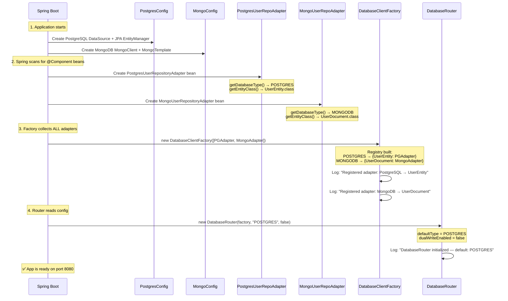
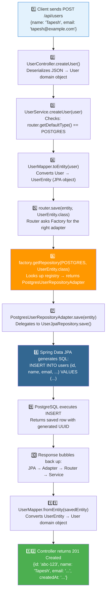
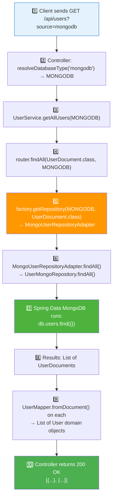
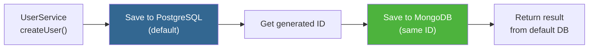
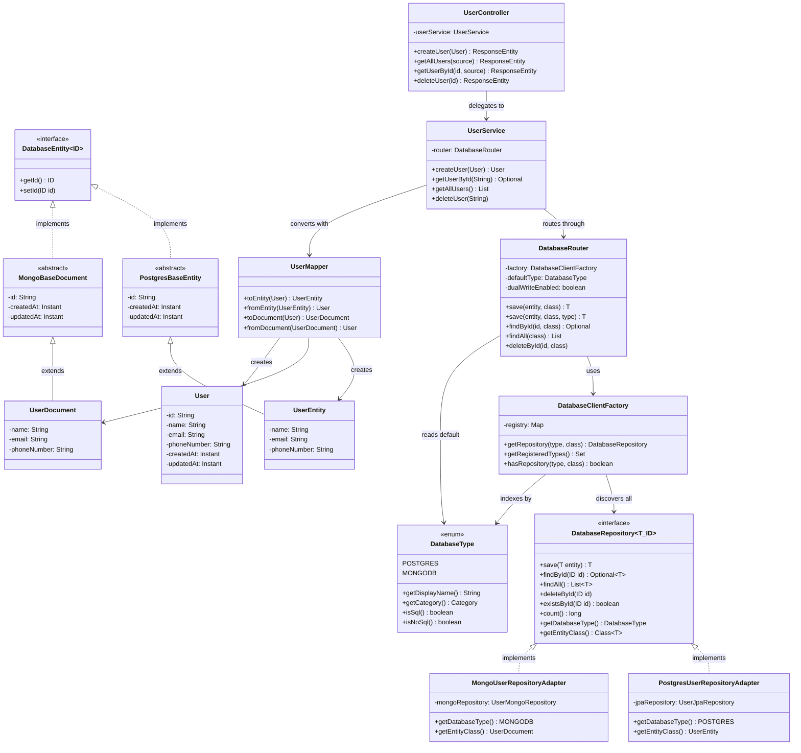

# 📖 How This Project Works — Complete Code Explanation

> This document explains **every class**, **why it exists**, **how they connect**, and traces a full request from HTTP to database and back.

---

## 📑 Table of Contents

1. [The Problem We Are Solving](#1-the-problem-we-are-solving)
2. [Why So Many Classes?](#2-why-so-many-classes)
3. [Application Startup — What Happens When You Run the App](#3-application-startup--what-happens-when-you-run-the-app)
4. [Class-by-Class Explanation](#4-class-by-class-explanation)
5. [Complete Request Flow — Step by Step](#5-complete-request-flow--step-by-step)
6. [The Dual-Write Feature](#6-the-dual-write-feature)
7. [How Adding a New Database Works](#7-how-adding-a-new-database-works)
8. [Class Relationship Diagram](#8-class-relationship-diagram)

---

## 1. The Problem We Are Solving

Imagine you have a Spring Boot app that stores users in **PostgreSQL**. One day, your team decides:

> "We also need MongoDB for some features."

In a **naive approach**, you'd write separate code for each database everywhere:

```java
// ❌ BAD: Tightly coupled, violates Open/Closed Principle
public class UserService {
    private final UserJpaRepository pgRepo;      // PostgreSQL
    private final UserMongoRepository mongoRepo;  // MongoDB

    public User save(User user, String dbType) {
        if (dbType.equals("postgres")) {
            return pgRepo.save(convertToEntity(user));    // PostgreSQL-specific
        } else if (dbType.equals("mongodb")) {
            return mongoRepo.save(convertToDocument(user)); // MongoDB-specific
        }
        // ❌ Adding Cassandra? Modify this method, add another if-else...
    }
}
```

**Problems:**
- Every new database = change `UserService`, `OrderService`, `ProductService`...
- `if-else` chains grow endlessly
- Violates **Open/Closed Principle** (must modify existing code to extend)

**Our solution:** An abstraction layer where the service **doesn't know or care** which database it's talking to.

---

## 2. Why So Many Classes?

Each class has **one specific job** (Single Responsibility Principle). Here's a quick map:

```
"I need many classes because each one does ONE thing well"

┌─────────────────────────────────────────────────────────────────────┐
│ LAYER 1: What databases do we support?                              │
│   → DatabaseType.java          (enum: POSTGRES, MONGODB)            │
│   → DatabaseEntity.java        (common contract: every entity has   │
│                                  getId/setId)                       │
├─────────────────────────────────────────────────────────────────────┤
│ LAYER 2: What can we do with any database?                          │
│   → DatabaseRepository.java    (interface: save, find, delete —     │
│                                  same for ANY database)             │
├─────────────────────────────────────────────────────────────────────┤
│ LAYER 3: Who does the actual database work?                         │
│   → PostgresUserRepositoryAdapter.java  (talks to PostgreSQL)       │
│   → MongoUserRepositoryAdapter.java     (talks to MongoDB)          │
├─────────────────────────────────────────────────────────────────────┤
│ LAYER 4: How do we pick the right one?                              │
│   → DatabaseClientFactory.java (collects ALL adapters, picks the    │
│                                  right one by type + entity)        │
│   → DatabaseRouter.java        (reads config, routes to default DB) │
├─────────────────────────────────────────────────────────────────────┤
│ LAYER 5: Business logic + API                                       │
│   → User.java / UserMapper.java (domain model + conversion)        │
│   → UserService.java           (business rules)                     │
│   → UserController.java        (HTTP endpoints)                     │
└─────────────────────────────────────────────────────────────────────┘
```

**Why not fewer classes?** Because if you merge responsibilities, adding a new database means modifying existing files. With this structure, you **only add new files**.

---

## 3. Application Startup — What Happens When You Run the App

When you run `./mvnw spring-boot:run`, Spring Boot does this in order:



### Startup Logs You'll See:

```
Registered adapter: [PostgreSQL] → entity [UserEntity]
Registered adapter: [MongoDB] → entity [UserDocument]
DatabaseClientFactory initialized with 2 database type(s): [POSTGRES, MONGODB]
DatabaseRouter initialized — default: POSTGRES, dual-write: false
```

**Key insight:** The Factory doesn't have a hardcoded list of adapters. It accepts `List<DatabaseRepository<?, ?>>` — Spring automatically injects **every bean** that implements `DatabaseRepository`. So if you add a Cassandra adapter next month, it gets injected automatically without changing the Factory code.

---

## 4. Class-by-Class Explanation

### 4.1 `DatabaseType.java` — The ID Card

**Purpose:** Identifies which database an adapter belongs to.

```java
public enum DatabaseType {
    POSTGRES("PostgreSQL", Category.SQL),
    MONGODB("MongoDB", Category.NOSQL);

    public enum Category { SQL, NOSQL }
}
```

**Why it exists:**
- The Factory needs a key to index adapters → `DatabaseType` is that key
- The Router reads `app.database.default-type=POSTGRES` from config and converts it to this enum
- The `Category` (SQL/NOSQL) allows future routing decisions like "send all NoSQL queries to MongoDB"

**Analogy:** Think of it as a **name tag**. Every adapter wears one so the Factory knows who's who.

---

### 4.2 `DatabaseEntity<ID>` — The Common Language

**Purpose:** Every database entity (JPA Entity, Mongo Document, etc.) must implement this.

```java
public interface DatabaseEntity<ID> {
    ID getId();
    void setId(ID id);
}
```

**Why it exists:** The generic `DatabaseRepository<T extends DatabaseEntity<ID>, ID>` needs to know that every entity **at minimum** has an ID. Without this:
- The Factory couldn't build a type-safe registry
- The Router couldn't pass entities between different adapters

**Who implements it:**
- `PostgresBaseEntity` → for all JPA entities
- `MongoBaseDocument` → for all MongoDB documents

---

### 4.3 `DatabaseRepository<T, ID>` — The Contract

**Purpose:** Defines what **every** database adapter must be able to do.

```java
public interface DatabaseRepository<T extends DatabaseEntity<ID>, ID> {
    T save(T entity);
    Optional<T> findById(ID id);
    List<T> findAll();
    void deleteById(ID id);
    boolean existsById(ID id);
    long count();
    DatabaseType getDatabaseType();   // "I am POSTGRES"
    Class<T> getEntityClass();        // "I handle UserEntity.class"
}
```

**Why it exists:** This is the **Strategy Pattern**. The service layer calls `save()` — it doesn't know (or care) whether that goes to PostgreSQL or MongoDB. The actual behavior depends on which concrete adapter is plugged in.

**Why `getDatabaseType()` and `getEntityClass()`?** These two methods let each adapter **self-identify**:
- "I am the POSTGRES adapter for UserEntity"
- "I am the MONGODB adapter for UserDocument"

The Factory uses these to build its lookup table.

---

### 4.4 `DatabaseClientFactory` — The Phone Book

**Purpose:** Collects all adapters at startup, provides lookup by `(DatabaseType, EntityClass)`.

```java
@Component
public class DatabaseClientFactory {

    // The registry: DatabaseType → (EntityClass → Adapter)
    private final Map<DatabaseType, Map<Class<?>, DatabaseRepository<?, ?>>> registry;

    // Spring injects ALL DatabaseRepository beans automatically
    public DatabaseClientFactory(List<DatabaseRepository<?, ?>> repositories) {
        for (DatabaseRepository<?, ?> repo : repositories) {
            registry
                .computeIfAbsent(repo.getDatabaseType(), k -> new ConcurrentHashMap<>())
                .put(repo.getEntityClass(), repo);
        }
    }

    // Lookup: "Give me the POSTGRES adapter for UserEntity"
    public <T, ID> DatabaseRepository<T, ID> getRepository(DatabaseType type, Class<T> entityClass) {
        return registry.get(type).get(entityClass);
    }
}
```

**How it works internally:**

```
registry = {
    POSTGRES → {
        UserEntity.class  → PostgresUserRepositoryAdapter
    },
    MONGODB → {
        UserDocument.class → MongoUserRepositoryAdapter
    }
}
```

When the Router calls `factory.getRepository(POSTGRES, UserEntity.class)`, it returns `PostgresUserRepositoryAdapter`.

**Why it exists:** Without this, the Router would need hardcoded `if (type == POSTGRES) use pgAdapter; else if (type == MONGODB) use mongoAdapter;` — which breaks when you add Cassandra. The Factory makes it **automatic**.

---

### 4.5 `DatabaseRouter` — The Traffic Controller

**Purpose:** The single entry point for all database operations. Reads config to decide which database to use.

```java
@Component
public class DatabaseRouter {

    private final DatabaseClientFactory factory;
    private final DatabaseType defaultType;      // from application.yml
    private final boolean dualWriteEnabled;       // from application.yml

    // "Save to the default database"
    public <T> T save(T entity, Class<T> entityClass) {
        return factory.getRepository(defaultType, entityClass).save(entity);
    }

    // "Save to a SPECIFIC database"
    public <T> T save(T entity, Class<T> entityClass, DatabaseType targetType) {
        return factory.getRepository(targetType, entityClass).save(entity);
    }
}
```

**Why it exists:** Services don't know about the Factory's internal registry. They just say "save this" and the Router figures out where.

**Config-driven behavior:**
```yaml
app:
  database:
    default-type: POSTGRES        # Router uses POSTGRES adapter by default
    dual-write-enabled: false     # If true, write to ALL databases
```

Change `default-type` to `MONGODB` → the entire app now uses MongoDB. **Zero code changes.**

---

### 4.6 PostgreSQL Module — The Actual Database Work

#### `PostgresBaseEntity` — Reusable base for all PG entities

```java
@MappedSuperclass                          // JPA: "don't create a table for this, it's a base class"
@EntityListeners(AuditingEntityListener.class)  // JPA: "auto-fill createdAt/updatedAt"
public abstract class PostgresBaseEntity implements DatabaseEntity<String> {

    @Id
    @GeneratedValue(strategy = GenerationType.UUID)  // Auto-generate UUID
    private String id;

    @CreatedDate
    private Instant createdAt;      // Filled automatically on first save

    @LastModifiedDate
    private Instant updatedAt;      // Updated automatically on every save
}
```

#### `UserEntity` — The actual User table

```java
@Entity
@Table(name = "users")
public class UserEntity extends PostgresBaseEntity {   // inherits id, createdAt, updatedAt
    private String name;
    private String email;
    private String phoneNumber;
}
```

This maps to a PostgreSQL table:
```sql
CREATE TABLE users (
    id          VARCHAR(36) PRIMARY KEY,   -- from PostgresBaseEntity
    name        VARCHAR(255) NOT NULL,
    email       VARCHAR(255) NOT NULL UNIQUE,
    phone_number VARCHAR(255),
    created_at  TIMESTAMP,                  -- from PostgresBaseEntity
    updated_at  TIMESTAMP                   -- from PostgresBaseEntity
);
```

#### `UserJpaRepository` — Spring Data JPA magic

```java
public interface UserJpaRepository extends JpaRepository<UserEntity, String> {
    Optional<UserEntity> findByEmail(String email);
}
```

Spring auto-generates the implementation at runtime. You write the interface, Spring writes the SQL.

#### `PostgresUserRepositoryAdapter` — The Bridge

```java
@Component
public class PostgresUserRepositoryAdapter implements DatabaseRepository<UserEntity, String> {

    private final UserJpaRepository jpaRepository;    // Spring Data JPA

    @Override
    public UserEntity save(UserEntity entity) {
        return jpaRepository.save(entity);             // delegate to JPA
    }

    @Override
    public DatabaseType getDatabaseType() {
        return DatabaseType.POSTGRES;                  // "I am POSTGRES"
    }

    @Override
    public Class<UserEntity> getEntityClass() {
        return UserEntity.class;                       // "I handle UserEntity"
    }
}
```

**Why not use `UserJpaRepository` directly?** Because `JpaRepository` and `MongoRepository` have **different interfaces**. The adapter wraps them both behind the **same** `DatabaseRepository` interface — that's what makes them interchangeable.

---

### 4.7 MongoDB Module — Mirror Structure

The MongoDB module follows the **exact same pattern** as PostgreSQL:

| PostgreSQL | MongoDB | Purpose |
|------------|---------|---------|
| `PostgresBaseEntity` | `MongoBaseDocument` | Base class with id + timestamps |
| `UserEntity` (@Entity) | `UserDocument` (@Document) | Actual data model |
| `UserJpaRepository` | `UserMongoRepository` | Spring Data repository |
| `PostgresUserRepositoryAdapter` | `MongoUserRepositoryAdapter` | Bridge to `DatabaseRepository` |

**This symmetry is intentional.** Any future database module (Cassandra, Redis, DynamoDB) follows the same 4-file pattern.

---

### 4.8 Domain Layer — The Translator

#### `User.java` — Pure domain model

```java
public class User {
    private String id;
    private String name;
    private String email;
    private String phoneNumber;
    private Instant createdAt;
    private Instant updatedAt;
}
```

**Why a separate model?** The controller and service should NOT work with `UserEntity` (JPA) or `UserDocument` (Mongo) directly because:
- `UserEntity` has JPA annotations (`@Entity`, `@Table`) — the controller shouldn't know about JPA
- `UserDocument` has Mongo annotations (`@Document`) — the controller shouldn't know about MongoDB
- `User` is **pure** — no database annotations, no framework dependencies

#### `UserMapper.java` — The Converter

```java
public final class UserMapper {
    // Domain → PostgreSQL
    public static UserEntity toEntity(User user) { ... }
    public static User fromEntity(UserEntity entity) { ... }

    // Domain → MongoDB
    public static UserDocument toDocument(User user) { ... }
    public static User fromDocument(UserDocument doc) { ... }
}
```

**Data flow:**
```
HTTP JSON → User (domain) → UserMapper → UserEntity (JPA) → PostgreSQL
HTTP JSON → User (domain) → UserMapper → UserDocument (Mongo) → MongoDB
```

---

### 4.9 `UserService` — Business Logic

```java
@Service
public class UserService {
    private final DatabaseRouter router;    // Only dependency — not JPA, not Mongo

    public User createUser(User user) {
        if (router.getDefaultType() == DatabaseType.POSTGRES) {
            UserEntity entity = UserMapper.toEntity(user);
            UserEntity saved = router.save(entity, UserEntity.class);
            return UserMapper.fromEntity(saved);
        } else {
            UserDocument doc = UserMapper.toDocument(user);
            UserDocument saved = router.save(doc, UserDocument.class);
            return UserMapper.fromDocument(saved);
        }
    }
}
```

The service only talks to `DatabaseRouter`. It doesn't import `UserJpaRepository` or `UserMongoRepository`.

---

### 4.10 `UserController` — HTTP Layer

```java
@RestController
@RequestMapping("/api/users")
public class UserController {

    @PostMapping
    public ResponseEntity<User> createUser(@RequestBody User user) {
        return ResponseEntity.status(201).body(userService.createUser(user));
    }

    @GetMapping
    public ResponseEntity<List<User>> getAllUsers(@RequestParam(required = false) String source) {
        if (source != null) {
            DatabaseType type = resolveDatabaseType(source);  // "mongodb" → MONGODB
            return ResponseEntity.ok(userService.getAllUsers(type));
        }
        return ResponseEntity.ok(userService.getAllUsers());
    }
}
```

The `?source=` parameter lets the client choose which database to query.

---

## 5. Complete Request Flow — Step by Step

### Example: `POST /api/users` with body `{"name":"Tapesh","email":"tapesh@example.com"}`



### Example: `GET /api/users?source=mongodb`



---

## 6. The Dual-Write Feature

When `app.database.dual-write-enabled=true`, every write goes to **all** registered databases:



**Why same ID?** So you can query the same user from either database:
```bash
curl /api/users/abc-123?source=postgres   # ← finds it
curl /api/users/abc-123?source=mongodb    # ← also finds it (same ID)
```

**Why is dual-write useful?**
- **Database migration:** Gradually move from PostgreSQL to MongoDB (or vice versa) without downtime
- **Read optimization:** Read from the faster DB, write to both for consistency

---

## 7. How Adding a New Database Works

### The Magic: Spring Dependency Injection

When Spring starts, it scans for **all classes annotated with `@Component`**. The `DatabaseClientFactory` constructor accepts `List<DatabaseRepository<?, ?>>` — Spring fills this list with **every bean** that implements `DatabaseRepository`.

**Before adding Cassandra:**
```
Spring finds: [PostgresUserRepositoryAdapter, MongoUserRepositoryAdapter]
Factory receives: List of 2 adapters
Registry: {POSTGRES: {...}, MONGODB: {...}}
```

**After adding Cassandra (just drop in the new @Component class):**
```
Spring finds: [PostgresUserRepositoryAdapter, MongoUserRepositoryAdapter, CassandraUserRepositoryAdapter]
Factory receives: List of 3 adapters
Registry: {POSTGRES: {...}, MONGODB: {...}, CASSANDRA: {...}}
```

**No one told the Factory about Cassandra.** Spring did it automatically.

### Step-by-step: Add Cassandra

```
Step 1: Add dependency to pom.xml
        spring-boot-starter-data-cassandra

Step 2: Create 4 files in cassandra/ package:
        cassandra/
        ├── entity/
        │   ├── CassandraBaseEntity.java         implements DatabaseEntity<String>
        │   └── UserCassandraEntity.java         @Table, extends CassandraBaseEntity
        ├── repository/
        │   └── UserCassandraRepository.java     extends CassandraRepository
        └── adapter/
            └── CassandraUserRepoAdapter.java    @Component, implements DatabaseRepository
                                                  getDatabaseType() → CASSANDRA
                                                  getEntityClass() → UserCassandraEntity.class

Step 3: Add to DatabaseType enum:
        CASSANDRA("Cassandra", Category.NOSQL)

Step 4: Nothing. You're done.
        The Factory auto-discovers CassandraUserRepoAdapter.
        The Router can now route to CASSANDRA.
        The Controller accepts ?source=cassandra.
```

---

## 8. Class Relationship Diagram



---

## Summary: Why Each Class Exists

| Class | One-Line Purpose | Design Pattern |
|-------|-----------------|----------------|
| `DatabaseType` | ID card for each database | Enum |
| `DatabaseEntity` | "Every entity has an ID" contract | Marker Interface |
| `DatabaseRepository` | "Every adapter can save/find/delete" contract | **Strategy** |
| `DatabaseClientFactory` | Auto-collects adapters, provides lookup | **Abstract Factory** |
| `DatabaseRouter` | Routes to default DB or specific DB | **Facade** |
| `PostgresBaseEntity` | Base class for JPA entities (id + timestamps) | Template Method |
| `UserEntity` | JPA entity → `users` table | Data Model |
| `UserJpaRepository` | Spring auto-generates SQL queries | Repository |
| `PostgresUserRepositoryAdapter` | Wraps JPA behind `DatabaseRepository` | **Adapter** |
| `MongoBaseDocument` | Base class for Mongo docs (id + timestamps) | Template Method |
| `UserDocument` | Mongo document → `users` collection | Data Model |
| `UserMongoRepository` | Spring auto-generates Mongo queries | Repository |
| `MongoUserRepositoryAdapter` | Wraps Mongo behind `DatabaseRepository` | **Adapter** |
| `User` | Pure domain model — no DB annotations | Domain Object |
| `UserMapper` | Converts `User` ↔ `UserEntity` ↔ `UserDocument` | Mapper |
| `UserService` | Business logic — talks to Router only | Service |
| `UserController` | HTTP endpoints — talks to Service only | Controller |
| `PostgresConfig` | Configures JPA scanning to `postgres/` package | Configuration |
| `MongoConfig` | Configures Mongo scanning to `mongo/` package | Configuration |

**Total: 19 classes. Each does exactly one thing. None needs to change when you add a new database.**
