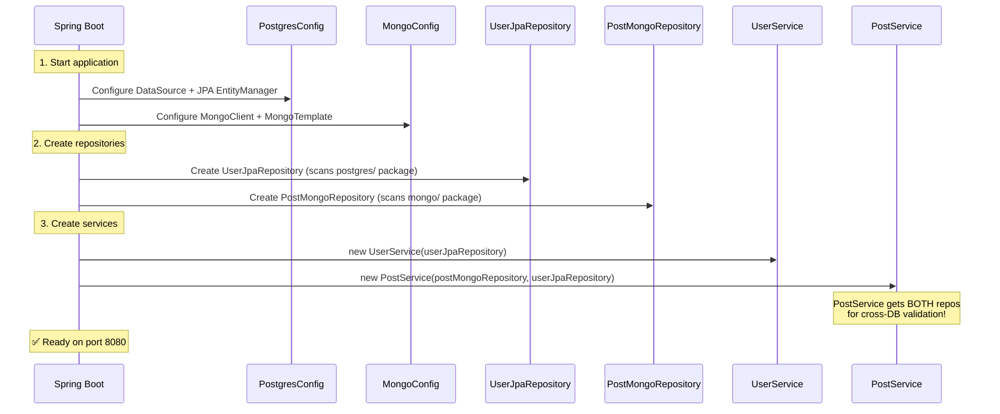

# 📖 How This Project Works — Complete Code Explanation

> This document explains **every class**, **why it exists**, and traces the complete request flow from HTTP to database and back.

---

## 📑 Table of Contents

1. [The Core Idea: Polyglot Persistence](#1-the-core-idea-polyglot-persistence)
2. [Why This Approach Over Routing/Adapters](#2-why-this-approach-over-routingadapters)
3. [Application Startup](#3-application-startup)
4. [Class-by-Class Explanation](#4-class-by-class-explanation)
5. [Complete Request Flow — Step by Step](#5-complete-request-flow--step-by-step)
6. [Cross-Database References](#6-cross-database-references)
7. [How Adding a New Database Works](#7-how-adding-a-new-database-works)
8. [Summary Table](#8-summary-table)

---

## 1. The Core Idea: Polyglot Persistence

**Polyglot Persistence** means using the **right database for the right data**:

```
Users (structured, relational)     →  PostgreSQL
Posts (flexible, document-oriented) →  MongoDB
Analytics (time-series, future)    →  Cassandra
Sessions (key-value, future)       →  Redis
```

Each entity is **permanently bound** to one database. No switching, no routing. Each service directly uses the repository of its database.

```
UserService  ──→  UserJpaRepository   ──→  PostgreSQL
PostService  ──→  PostMongoRepository ──→  MongoDB
```

---

## 2. Why This Approach Over Routing/Adapters

### ❌ The Wrong Way (What We Had Before)

```java
// Over-engineered: Factory + Router + Adapters for the SAME entity
DatabaseRouter → DatabaseClientFactory → PostgresAdapter → PostgreSQL
                                       → MongoAdapter    → MongoDB

// "Route this User to either Postgres OR MongoDB based on config"
// This is WRONG because: when would you ever want the same User in two different DBs?
```

This required **10 extra classes** (5 core abstractions + 2 adapters + mapper + wrong entities) to solve a problem that doesn't exist.

### ✅ The Right Way (What We Have Now)

```java
// Simple and direct: Each service uses its own repository
UserService → UserJpaRepository → PostgreSQL      // Users ALWAYS go here
PostService → PostMongoRepository → MongoDB        // Posts ALWAYS go here
```

This requires **0 extra abstraction classes**. Each service directly uses the Spring Data repository for its database. Simple, readable, and follows industry standards.

### Why Fewer Classes = Better Here

| Old Architecture | New Architecture | Difference |
|-----------------|-----------------|------------|
| 20 classes | 13 classes | -7 files removed |
| 5 abstraction classes (core/) | 0 abstraction classes | Not needed when entities are bound to one DB |
| 2 adapter classes | 0 adapter classes | Services use repositories directly |
| UserDocument + UserMongoRepo | PostDocument + PostMongoRepo | Correct entity in correct DB |

---

## 3. Application Startup

When you run `./mvnw spring-boot:run`:



**Key insight:** `PostService` receives **both** `PostMongoRepository` AND `UserJpaRepository`. This is how it validates that a post's author exists in PostgreSQL before saving the post in MongoDB.

---

## 4. Class-by-Class Explanation

### 4.1 Config Layer

#### `PostgresConfig.java`

```java
@Configuration
@EnableJpaRepositories(basePackages = "com.twotier_db.postgres.repository")
@EntityScan(basePackages = "com.twotier_db.postgres.entity")
@EnableJpaAuditing
public class PostgresConfig { }
```

**Why it exists:** Tells Spring "JPA repositories are ONLY in the `postgres/` package." Without this, Spring would try to create JPA repositories for MongoDB documents (and fail).

#### `MongoConfig.java`

```java
@Configuration
@EnableMongoRepositories(basePackages = "com.twotier_db.mongo.repository")
@EnableMongoAuditing
public class MongoConfig { }
```

**Why it exists:** Same idea — tells Spring "MongoDB repositories are ONLY in the `mongo/` package."

**These two configs prevent Spring from confusing JPA repos with Mongo repos.**

---

### 4.2 PostgreSQL Module — For Users

#### `PostgresBaseEntity.java` — Reusable base

```java
@MappedSuperclass   // "I'm a base class, don't create a table for me"
public abstract class PostgresBaseEntity {
    @Id
    @GeneratedValue(strategy = GenerationType.UUID)
    private String id;          // auto-generated UUID

    @CreatedDate
    private Instant createdAt;  // auto-filled on first save

    @LastModifiedDate
    private Instant updatedAt;  // auto-updated on every save
}
```

**Why it exists:** Every PostgreSQL entity needs an ID and timestamps. Instead of repeating this in every entity, we write it once and extend.

#### `UserEntity.java` — The actual User

```java
@Entity                    // "I am a JPA entity"
@Table(name = "users")     // "Store me in the 'users' table"
public class UserEntity extends PostgresBaseEntity {
    private String name;        // inherits id, createdAt, updatedAt from base
    private String email;
    private String phoneNumber;
}
```

**Maps to PostgreSQL table:**
```sql
CREATE TABLE users (
    id           VARCHAR(36) PRIMARY KEY,    -- from PostgresBaseEntity
    name         VARCHAR(255) NOT NULL,
    email        VARCHAR(255) NOT NULL UNIQUE,
    phone_number VARCHAR(255),
    created_at   TIMESTAMP,                   -- from PostgresBaseEntity
    updated_at   TIMESTAMP                    -- from PostgresBaseEntity
);
```

#### `UserJpaRepository.java` — Spring generates SQL for you

```java
public interface UserJpaRepository extends JpaRepository<UserEntity, String> {
    Optional<UserEntity> findByEmail(String email);
    boolean existsByEmail(String email);
}
```

You write the interface, Spring auto-generates the implementation. `findByEmail` becomes `SELECT * FROM users WHERE email = ?`.

---

### 4.3 MongoDB Module — For Posts

#### `MongoBaseDocument.java` — Reusable base

```java
public abstract class MongoBaseDocument {
    @Id
    private String id;          // MongoDB auto-generates ObjectId

    @CreatedDate
    private Instant createdAt;

    @LastModifiedDate
    private Instant updatedAt;
}
```

Same pattern as `PostgresBaseEntity` but for MongoDB documents.

#### `PostDocument.java` — The actual Post

```java
@Document(collection = "posts")   // "Store me in the 'posts' collection"
public class PostDocument extends MongoBaseDocument {
    @Indexed
    private String authorId;         // references PostgreSQL User.id
    private String authorName;       // denormalized from User for fast reads
    private String title;
    private String content;
    private List<String> tags;       // flexible arrays — perfect for MongoDB
    private List<String> mediaUrls;  // nested data — why we chose MongoDB
    private long likeCount;
    private long commentCount;
}
```

**Why MongoDB for Posts?**
- **Tags** are a variable-length array — MongoDB handles this natively
- **MediaUrls** are nested data — no need for a separate join table
- **Content** can be long-form text with no fixed schema
- Posts are read-heavy and benefit from MongoDB's horizontal scaling

**Why PostgreSQL for Users?**
- **Email uniqueness** needs ACID constraints
- **Transactions** (e.g., updating email + name atomically)
- User data is structured and relational

#### `PostMongoRepository.java`

```java
public interface PostMongoRepository extends MongoRepository<PostDocument, String> {
    List<PostDocument> findByAuthorIdOrderByCreatedAtDesc(String authorId);
    List<PostDocument> findByTagsContaining(String tag);
    long countByAuthorId(String authorId);
}
```

Spring auto-generates MongoDB queries from method names. `findByAuthorIdOrderByCreatedAtDesc` becomes `db.posts.find({authorId: "..."}).sort({createdAt: -1})`.

---

### 4.4 Domain Models

#### `User.java` — Database-agnostic

```java
public class User {
    private String id;
    private String name;
    private String email;
    private String phoneNumber;
    private Instant createdAt;
    private Instant updatedAt;
}
```

#### `Post.java` — Database-agnostic

```java
public class Post {
    private String id;
    private String authorId;
    private String authorName;
    private String title;
    private String content;
    private List<String> tags;
    private List<String> mediaUrls;
    private long likeCount;
    private long commentCount;
    private Instant createdAt;
    private Instant updatedAt;
}
```

**Why separate domain models?** Controllers and services should NOT work with `UserEntity` (JPA annotations) or `PostDocument` (Mongo annotations) directly. Domain models are **pure POJOs** — no database framework dependency.

---

### 4.5 Service Layer — Where the Magic Happens

#### `UserService.java` — Simple and direct

```java
@Service
public class UserService {
    private final UserJpaRepository userRepository;  // PostgreSQL only

    public User createUser(User user) {
        UserEntity entity = toEntity(user);          // domain → JPA
        UserEntity saved = userRepository.save(entity);  // save to PostgreSQL
        return fromEntity(saved);                    // JPA → domain
    }

    // Mapping methods: toEntity(), fromEntity() — convert between domain and JPA
}
```

**No Router, no Factory, no Adapter.** Just `UserService → UserJpaRepository → PostgreSQL`. Direct, readable, simple.

#### `PostService.java` — Cross-database service

```java
@Service
public class PostService {
    private final PostMongoRepository postRepository;   // MongoDB
    private final UserJpaRepository userRepository;     // PostgreSQL (for validation!)

    public Post createPost(Post post) {
        // Step 1: Validate author exists in PostgreSQL
        UserEntity author = userRepository.findById(post.getAuthorId())
                .orElseThrow(() -> new IllegalArgumentException("Author not found"));

        // Step 2: Denormalize author name (avoid cross-DB joins at read time)
        PostDocument doc = toDocument(post);
        doc.setAuthorName(author.getName());

        // Step 3: Save post to MongoDB
        PostDocument saved = postRepository.save(doc);
        return fromDocument(saved);
    }
}
```

**This is the key cross-database pattern:**
1. `PostService` has BOTH repositories injected by Spring
2. It queries PostgreSQL to validate the author exists
3. It copies the author's name into the post (denormalization)
4. It saves the post to MongoDB

No special framework needed — just standard Spring dependency injection.

---

### 4.6 Controller Layer

#### `UserController.java`

```java
@RestController
@RequestMapping("/api/users")
public class UserController {
    private final UserService userService;

    @PostMapping
    public ResponseEntity<User> createUser(@RequestBody User user) {
        return ResponseEntity.status(201).body(userService.createUser(user));
    }

    @GetMapping
    public ResponseEntity<List<User>> getAllUsers() {
        return ResponseEntity.ok(userService.getAllUsers());
    }
}
```

#### `PostController.java`

```java
@RestController
@RequestMapping("/api/posts")
public class PostController {
    private final PostService postService;

    @PostMapping
    public ResponseEntity<Post> createPost(@RequestBody Post post) {
        return ResponseEntity.status(201).body(postService.createPost(post));
    }

    @GetMapping
    public ResponseEntity<List<Post>> getPosts(
            @RequestParam(required = false) String authorId,
            @RequestParam(required = false) String tag) {
        // Filter by authorId, tag, or return all
    }
}
```

---

## 5. Complete Request Flow — Step by Step

### Flow 1: Create User → PostgreSQL

```
1. Client sends:  POST /api/users {"name":"Tapesh", "email":"tapesh@example.com"}
2. UserController receives the JSON, deserializes into User domain object
3. UserController calls userService.createUser(user)
4. UserService converts User → UserEntity (JPA object)
5. UserService calls userRepository.save(entity)
6. Spring Data JPA generates: INSERT INTO users (id, name, email, ...) VALUES (UUID, 'Tapesh', ...)
7. PostgreSQL executes the INSERT, returns saved row
8. UserService converts UserEntity → User (domain object)
9. UserController returns 201 Created with the User JSON
```

### Flow 2: Create Post → MongoDB (with PostgreSQL validation)

```
1. Client sends:  POST /api/posts {"authorId":"abc-123", "title":"Hello", "content":"..."}
2. PostController receives JSON, deserializes into Post domain object
3. PostController calls postService.createPost(post)
4. PostService calls userRepository.findById("abc-123")
   → This goes to POSTGRESQL to validate the author exists
5. PostgreSQL returns UserEntity {name: "Tapesh"}
6. PostService converts Post → PostDocument (Mongo object)
7. PostService sets doc.authorName = "Tapesh" (denormalized from PostgreSQL)
8. PostService calls postRepository.save(doc)
9. Spring Data MongoDB generates: db.posts.insertOne({authorId:"abc-123", authorName:"Tapesh", ...})
10. MongoDB executes the insert, returns saved document
11. PostService converts PostDocument → Post (domain object)
12. PostController returns 201 Created with the Post JSON
```

**The cross-database interaction happens at step 4-5:** PostService queries PostgreSQL to get the author's name, then writes to MongoDB at step 8-9.

---

## 6. Cross-Database References

Since Users and Posts live in different databases, we can't use traditional foreign keys. Instead:

```
PostgreSQL (users table)              MongoDB (posts collection)
┌───────────────────────┐             ┌────────────────────────────┐
│ id: "abc-123"         │◄────────────│ authorId: "abc-123"        │
│ name: "Tapesh"        │─ ─ ─copied─▶│ authorName: "Tapesh"       │
│ email: "t@example.com"│             │ title: "My Post"           │
└───────────────────────┘             │ content: "..."             │
                                      │ tags: ["java", "spring"]   │
                                      └────────────────────────────┘
```

- **`authorId`** = cross-DB reference (like a foreign key, but across databases)
- **`authorName`** = denormalized copy (avoids querying PostgreSQL on every post read)

**Trade-off:** If a user changes their name, you need to update all their posts. This is the standard trade-off in polyglot persistence — optimized for reads, extra work on writes.

---

## 7. How Adding a New Database Works

### Example: Adding Redis for Sessions

```
Step 1: pom.xml → add spring-boot-starter-data-redis

Step 2: Create config/RedisConfig.java
        @Configuration
        @EnableRedisRepositories(basePackages = "com.twotier_db.redis.repository")
        public class RedisConfig { }

Step 3: Create redis/entity/SessionEntity.java
        @RedisHash("sessions")
        public class SessionEntity { ... }

Step 4: Create redis/repository/SessionRedisRepository.java
        public interface SessionRedisRepository extends CrudRepository<SessionEntity, String> { }

Step 5: Create service/SessionService.java
        @Service
        public class SessionService {
            private final SessionRedisRepository sessionRepo;
            // direct usage — no routing, no factory
        }

Step 6: Create controller/SessionController.java
```

**Existing files changed: 0.** That's the Open/Closed Principle.

---

## 8. Summary Table

| Class | Database | Purpose |
|-------|----------|---------|
| **PostgresConfig** | PostgreSQL | JPA configuration, scoped to `postgres/` package |
| **PostgresBaseEntity** | PostgreSQL | Base class: UUID id + audit timestamps |
| **UserEntity** | PostgreSQL | `@Entity` → `users` table |
| **UserJpaRepository** | PostgreSQL | Spring Data JPA interface (auto-generates SQL) |
| **MongoConfig** | MongoDB | MongoDB configuration, scoped to `mongo/` package |
| **MongoBaseDocument** | MongoDB | Base class: id + audit timestamps |
| **PostDocument** | MongoDB | `@Document` → `posts` collection |
| **PostMongoRepository** | MongoDB | Spring Data MongoDB interface (auto-generates queries) |
| **User** | None | Database-agnostic domain POJO |
| **Post** | None | Database-agnostic domain POJO |
| **UserService** | PostgreSQL | Business logic — uses `UserJpaRepository` directly |
| **PostService** | Both | Business logic — uses `PostMongoRepository` + `UserJpaRepository` for validation |
| **UserController** | — | REST endpoints for `/api/users` |
| **PostController** | — | REST endpoints for `/api/posts` |

**Total: 14 classes. Each does one thing. Zero abstraction overhead. Adding a new database = new files only.**
